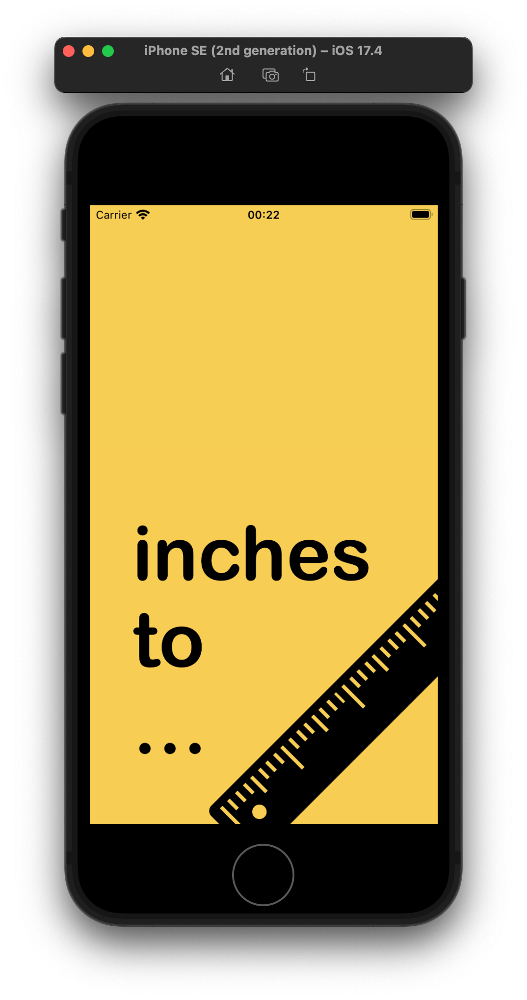
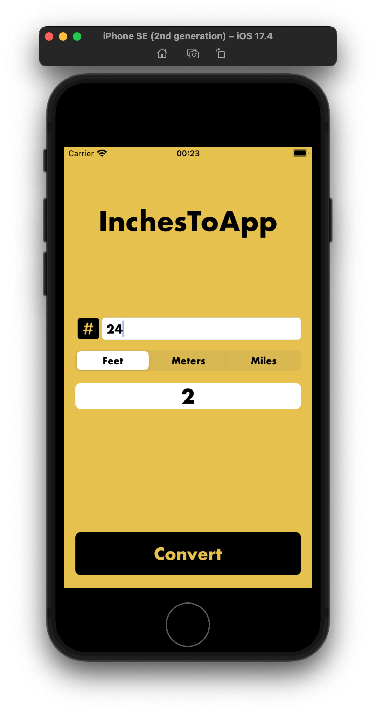
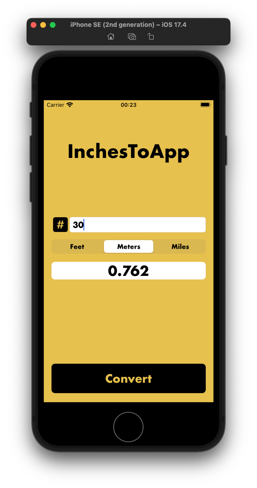

# InchesToApp
InchesToApp is an application designed for performing metric conversion tasks. It allows users to convert measurements entered in inches to feet, meters, and miles. I developed this project to enhance my skills in Objective-C programming.

### Objectives
- Strengthen proficiency in Objective-C programming language
- Gain practical experience in developing iOS applications using Objective-C
- Implement design patterns and architectural principles in Objective-C projects
- Improve code readability, maintainability, and efficiency in Objective-C codebases

## Screenshots
<div style="display: flex; justify-content: space-around;">
    
    
    
</div>

## Features
- Convert measurements from inches to feet, meters, and miles.
- User-friendly interface.

## Getting Started
To get started with the project, follow these steps:
1. Clone the repository to your local machine:
```bash
https://github.com/iammertozcan/InchesToApp.git
```
2. Open the project in your preferred IDE (e.g., Xcode).
3. Run the `DistCalApp.xcodeproj` file.
4. Start using the application to convert measurements!

## Usage
1. Enter the measurement you want to convert in inches.
2. Select the desired unit (feet, meters, or miles).
3. Click the "Convert" button to see the converted measurement in the chosen unit.
4. The application will display the converted measurements in the specified units.

## Contributing
Contributions are welcome! If you'd like to contribute to this project, please follow the steps below:
1. Fork this repository (https://github.com/iammertozcan/InchesToApp)
2. Create a new branch for your feature or bug fix:
```
git checkout -b feature/NewFeature
```
3. Commit your changes:
```
git commit -am 'Added a new feature'
```
4. Push your branch to your fork:
```
git push origin feature/NewFeature
```
5. Create a new Pull Request.

## Contact
If you have any questions or feedback, please reach out to us at [iammertozcan@gmail.com](mailto:iammertozcan@gmail.com).
